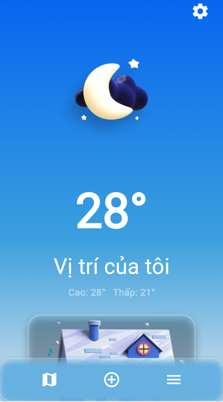
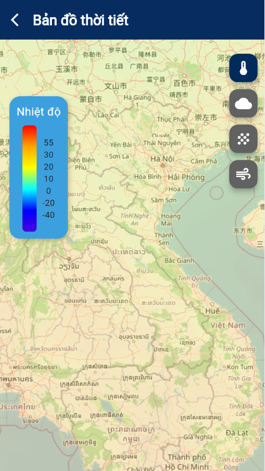

# 🌦️ **WEATHER FORECAST APP**

> Ứng dụng dự báo thời tiết trực quan – hiện đại – thân thiện, giúp bạn nắm bắt thời tiết **mọi lúc, mọi nơi!**  

---

## 👥 **Thông Tin Nhóm**

| Thành viên | MSSV |
|-------------|------|
| 👨‍💻 **Nguyễn Tuấn Thành** | 23010626 |
| 👨‍💻 **Nguyễn Huy Hoàng** | 23010143 |

**Môn học:** *Lập trình cho thiết bị di động - N02*  
**Giảng viên hướng dẫn:** *Ths. Nguyễn Xuân Quế*  
**Trường:** *Đại học Phenikaa*

---

## 🌍 **Giới thiệu Dự án**

**Weather Forecast App** là ứng dụng được phát triển bằng **Flutter**, giúp người dùng:

✅ Xem thông tin thời tiết của nhiều thành phố trên thế giới.  
✅ Tìm kiếm, thêm hoặc xóa **thành phố yêu thích**.  
✅ Xem **bản đồ thời tiết trực quan**: nhiệt độ 🌡️, lượng mưa 🌧️, mây ☁️, và gió 💨.  
✅ Giao diện **hiện đại – mượt mà – thân thiện**.  

---

## ⚙️ **Công nghệ sử dụng**

| Thành phần | Mô tả |
|-------------|-------|
| 🧠 **Ngôn ngữ** | Dart |
| 💎 **Framework** | Flutter |
| ☁️ **API** | OpenWeatherMap API |
| 🎨 **Giao diện** | Material Design, Cupertino Style |
| 🛠️ **Công cụ** | Visual Studio Code |
| 📱 **Nền tảng chạy** | Web, Android, iOS |

---

## 🚀 **Các chức năng chính**

### 🏁 Mở đầu:
- Giới thiệu nhanh về các tính năng có trong ứng dụng.

### 🌤️ 1. **Màn hình chính**
- Hiển thị thông tin thời tiết chi tiết của vị trí hiện tại.  
- Cung cấp các chỉ số như: nhiệt độ, độ ẩm, tốc độ gió, cảm giác thực tế, v.v.  
- Có thanh điều hướng nhanh đến các phần khác.

### 🔎 2. **Màn hình “Tìm kiếm thành phố”**
- Cho phép người dùng nhập tên thành phố cần tra cứu.  
- Hiển thị **gợi ý tự động** khi gõ.  
- Giao diện tìm kiếm mượt mà và trực quan.

### 🗺️ 3. **Màn hình “Bản đồ thời tiết”**
- Hiển thị bản đồ thế giới với **lớp phủ dữ liệu** (nhiệt độ, mưa, mây, gió).  
- Có **thanh màu thể hiện thang nhiệt độ**.  
- Người dùng có thể chuyển đổi giữa các lớp dữ liệu bằng nút chọn.

### ❤️ 4. **Màn hình “Yêu thích”**
- Danh sách các **thành phố yêu thích** của người dùng.  
- Cho phép **xóa** hoặc **xem chi tiết** thông tin thời tiết từng thành phố.

### 🌐 5. **Hỗ trợ song ngữ**
- Hỗ trợ **2 ngôn ngữ:** 🇻🇳 Tiếng Việt & 🇬🇧 Tiếng Anh.  
- Tự động thay đổi ngôn ngữ trong cài đặt ứng dụng.

---

## 🖼️ **Giao diện minh họa**

| Màn hình | Hình ảnh |
|-----------|-----------|
| 🏁 **Màn hình mở đầu** |  |
| 🌤️ **Màn hình chính** |  |
| 🗺️ **Bản đồ thời tiết** |  |
| 🔎 **Tìm kiếm thành phố** |  |
| ❤️ **Danh sách yêu thích** |  |

---

## 🧠 **Kết quả đạt được**

✨ Ứng dụng hoạt động **ổn định** trên cả **Web và thiết bị di động**.  
🎨 Giao diện hiện đại, **tốc độ phản hồi nhanh**, trải nghiệm người dùng tốt.  
🧩 Mã nguồn được **tổ chức rõ ràng**, dễ dàng mở rộng và bảo trì.  
🚀 Là nền tảng tốt để phát triển thêm các tính năng thông minh (AI, dự báo dài hạn...).

---

## ⚡ **Hướng dẫn cài đặt & chạy ứng dụng**

```bash
# 1️⃣ Clone dự án
git clone https://github.com/ngtthanh365/2025_LTTBDD_N02_Nhom_6.git

# 2️⃣ Di chuyển vào thư mục dự án
cd weather_app

# 3️⃣ Cài đặt các gói phụ thuộc
flutter pub get

# 4️⃣ Chạy ứng dụng
flutter run
